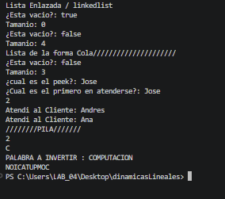
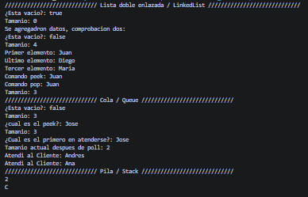
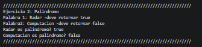

# Práctica: Estructuras Dinámicas Lineales

## Datos del Estudiante
- **Nombre:** [David Fernando Fajardo Leon]
- **Curso:** [Grupo 1]
- **Fecha:** [10/06/2026]

## 1. Implementación de estructuras dinámicas lineales

**Fecha:** [8/06/2026]

**Descripción:** Se realizaron 3 métodos estáticos para explorar las funciones de cada estructura dinámica lineal. Stack (pila). Queue (cola) y linkedList (funciona como pila y cola). En el ejercicio 1 tambien se realizó un metodo que invierte un texto ingresado usando una pila para descomponerlo y agregar de manera inversa en una nueva variable que se retorna al final.

### Captura de salida en consola

### Captura del código de implementación del ejercicio 1

## 2. Ejercicio Palíndromo

**Fecha:** [10/06/2026]

**Descripción:**
Se creo un método que verifica si un texto es un palindromo. En primer lugar 
se invirtió completamente la palabra ingresada, para evitar comparar individualmente letra por letra, una vez invertido,
se usa equals para comparar dos textos, retornando true si el texto pedido como parámetro es igual al invertido.
Siendo así esta la solución para saber si una palabra es palindromo o no.
Detalle: Se uso el ignoreCase para evitar que las mayusculas ocaciones un retorno falso equivocado.

### Método implementado

    public boolean esPalindromo(String texto) {

        Deque<Character> pila = new ArrayDeque<>();
        String invert = "";
        for(char letra : texto.toCharArray()){
            pila.push(letra);
        }
        while (!pila.isEmpty()) {
            invert += pila.pop();
        }

        return texto.equalsIgnoreCase(invert);

        //ES MAS SENCILLO USANDO EL METODO YA CREADO QUE HACE LO MISMO
        
        //String invertido = new Ejercicio1().invertString(texto);
        //return texto.equals(invertido);    
    } 

### Captura de salida en consola para ejercicio 2

